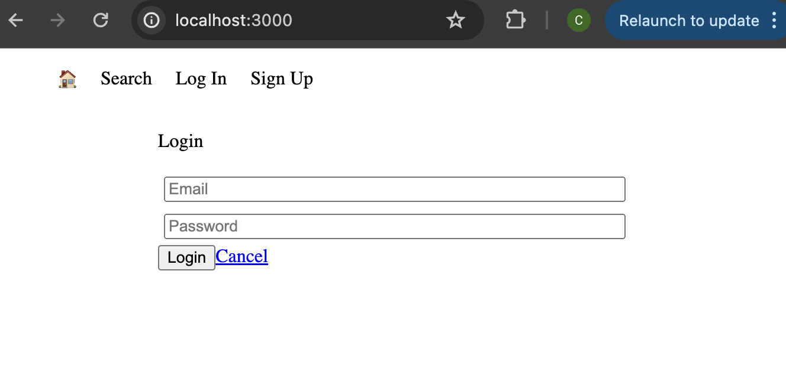
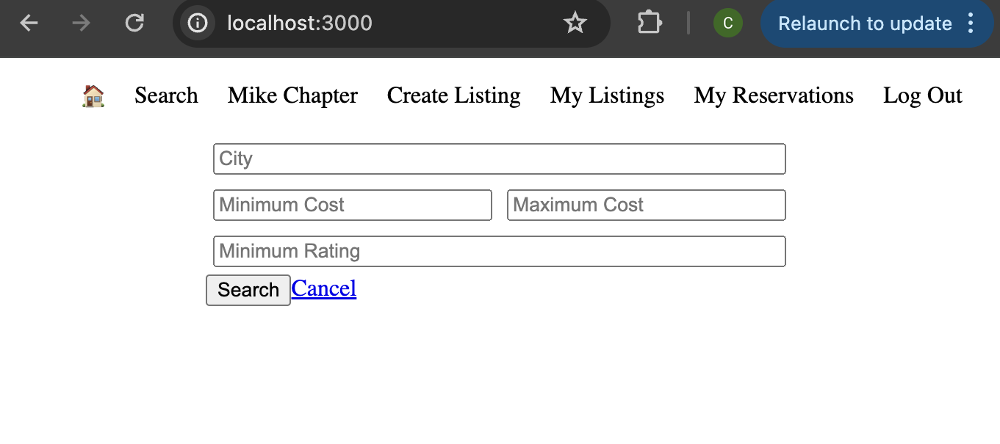

# LightBnB

LightBnB is an intuitive application reminiscent of AirBnB, designed for user simplicity.

Within LightBnB, users have the capability to browse through all available property listings, with the added functionality of filtering through listings in the search section by location, price, and rating criteria. Moreover, users can conveniently register for a personal account, granting them access to their reservation history and the ability to craft their own listings within the LightBnB platform.

LightBnB was developed using code provided by Lighthouse Labs, employing a stack that includes JavaScript, Express, and PostgreSQL.

## Dependencies
  * bcrypt: "^3.0.6"
  * cookie-session: "^1.3.3"
  * express: "^4.17.1"
  * nodemon: "^1.19.1"
  * pg: "^8.11.5"

## Getting Started

  1. Clone the repository into your local device.

          git clone git@github.com:charleysmithschofield/LightBnB.git

  2. Navigate into the database within LightBnB_WebApp directory:

          cd LightBnb/LightBnB_WebApp/db

  3. Install dependencies using the npm install command:

          npm install

  4. Start the web server using npm:
  
          npm run local
      
  5. Navigate to http://localhost:3000/ in your browser.

  6. Find a place to stay during your next get-away!

## LightBnB Features:

### Sign Up

### Login 

### Search

### Create Listings

### Listings

### Reservations

